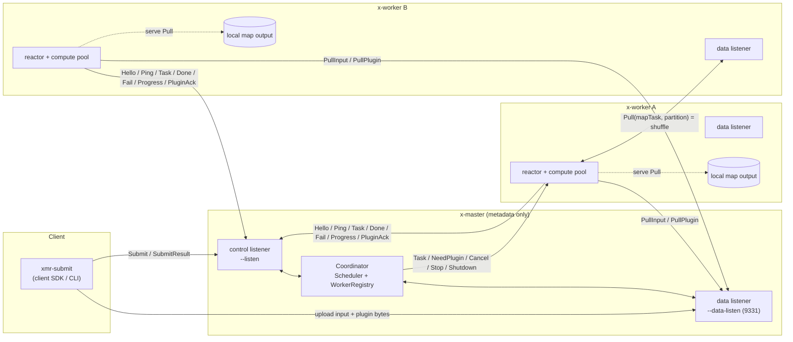
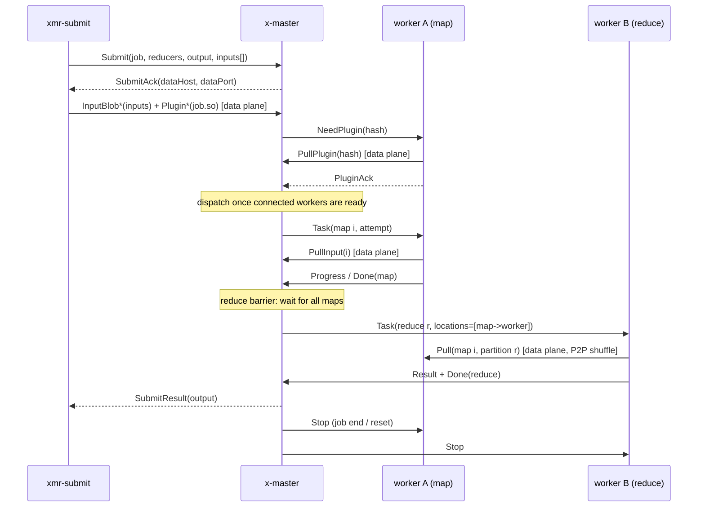
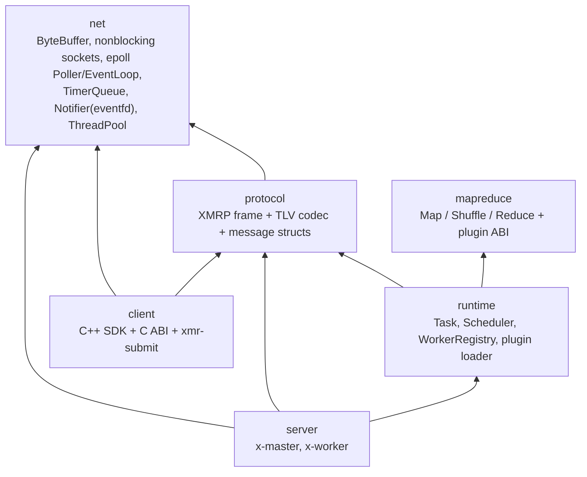

# Architecture

Mermaid diagrams below render directly on GitHub. They describe the current
implementation (persistent master/worker, control/data plane split,
worker-to-worker shuffle, runtime plugin distribution, speculative execution).

## 1. Deployment & control/data plane

- **Control plane** (small messages): submit, heartbeat, task scheduling, done/fail.
- **Data plane** (bulk): map input, plugin binaries, and the worker-to-worker shuffle.
- The master never carries bulk bytes; shuffle is peer-to-peer between workers.

## 2. Job lifecycle (happy path)

Plus fault handling on the same paths: heartbeat timeout -> worker `Lost` ->
reclaim + retry; a dead map worker's finished maps are invalidated and re-run;
a slow task is duplicated (speculation) and the loser gets `Cancel`.

## 3. Module layers

Reading order: `mapreduce` -> `runtime` -> `net` -> `protocol` -> `server/worker`
-> `server/master` -> `client`, with `tests/` as executable specs.
